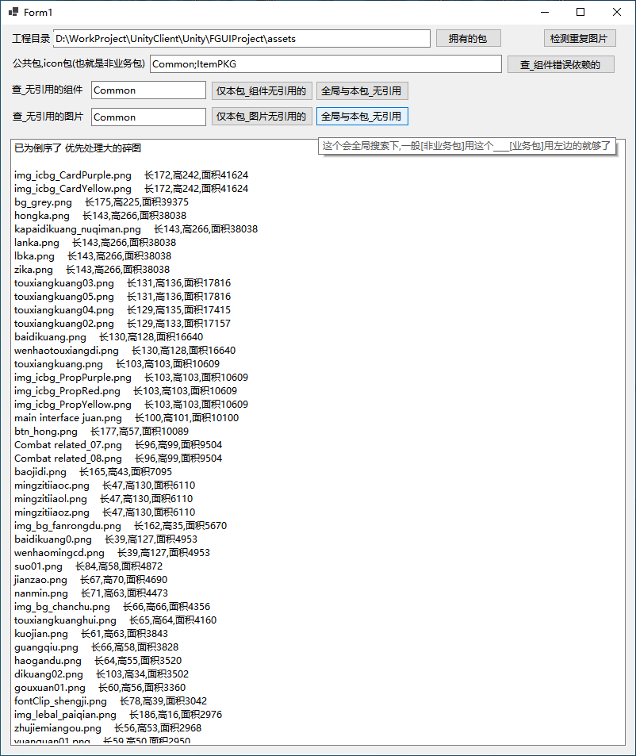

## FguiProject_Check
### 错误依赖_无直接引用

#### 拥有的包
    一.业务包对业务包的依赖 
    fairyGUI的制作上,一般默认有几个包是公共包,其他业务包可以直接引用,但业务包对业务包引用就成了制作上的错误了,美术策划同学也可以操作
	二.1.组件无直接的引用    2.图片无直接的引用
    做到中后期时,就发现图片越来越多,有一些(组件/图片)没有直接引用的,先对组件处理,再处理碎图,总而言之,就是没用过的删除掉呗
    (一般引用可分为 1.fairyGUI直接引用 2.代码引用 3.导表引用) 因代码中有无引用就前端能查.所以这功能只能前端使用
    三.检测重复图片
    一样的图片,在几个package中都存在着.若是大图得考虑是否挪到[公共包]中去

