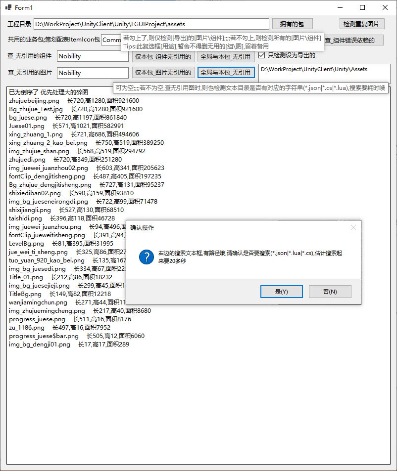

## FguiProject_Check
### 错误依赖_无直接引用

#### 拥有的包
    1.业务包对业务包的依赖 
    fairyGUI的制作上,一般默认有几个包是公共包,其他业务包可以直接引用,但业务包对业务包引用就成了制作上的错误了,美术策划同学也可以操作
    2.图片无直接的引用
    做到中后期时,就发现图片越来越多,有一些没有直接引用的,造成浪费图集的大小,要把无引用的碎图进行删除(fairyGUI直接引用,代码引用,导表引用) 但代码中有无引用就查不了.所以这功能只能程序使用

